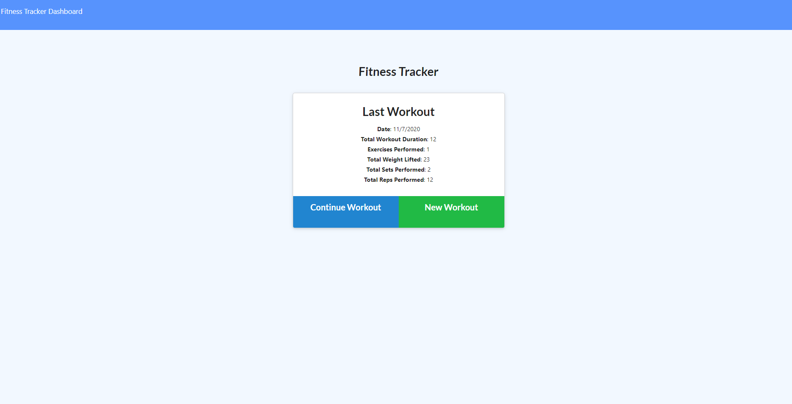
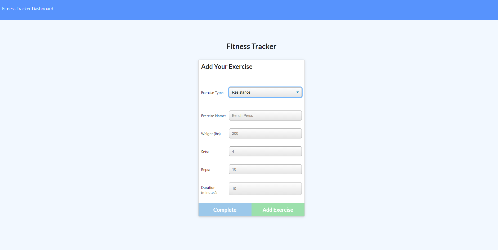
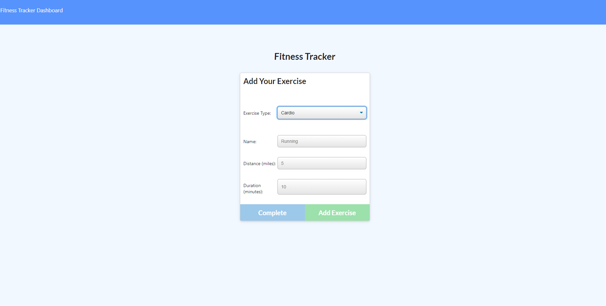
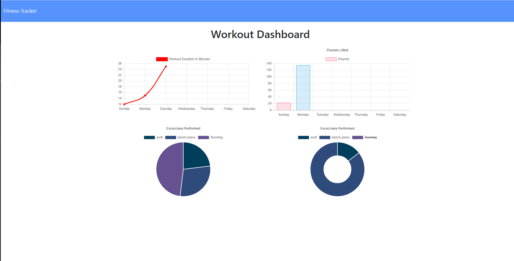
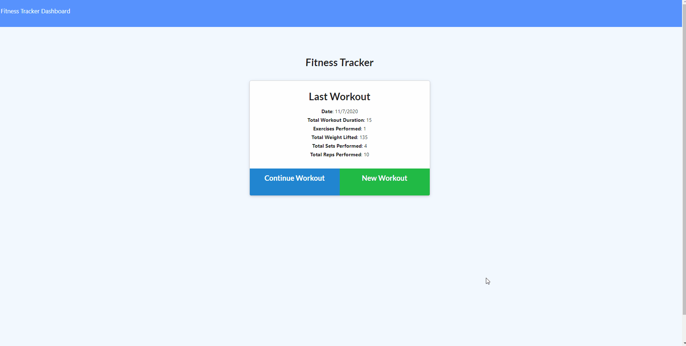

# fitness-tracker [](https://opensource.org/licenses/MIT)

## Links
Deployed Webpage: https://glacial-waters-05445.herokuapp.com/

## Table of Contents
* [User Story](#user-story)
* [Business Context](#business-context)
* [How Fitness Tracker Works](#how-fitness-tracker-works)
* [Usage](#usage)
* [Webpage Screenshots](#webpage-screenshots)
* [Webpage Demo](#webpage-demo)
* [Questions](#Questions)

## User Story
```
AS A person who works out frequently
I WANT to be able to log my daily excercises 
SO THAT I can keep track of the weight, set, reps and duration of exercise
```

## Business Context
A consumer will reach their fitness goals more quickly when they track their workout progress.

## How Fitness Tracker Works
Fitness Tracker allows users to keep track of their workout by tracking the name, type, weight, sets, reps, and duration of the exercise. Using mongoose, a model was created to allow the user to input their exercise information into the database and load once they click complete workout. The user is able to continue the workout and add more exercises, or start a new workout which provides them with a clean slate and generates new stats for them. 

## Usage
- Use Fitness Tracker from Deployed link above OR 
- In your terminal: 
    - Clone repository with `git clone` git@github.com:ktlnn/fitness-tracker.git
    - Run `npm install` OR `yarn install` to install dependencies for Fitness Tracker
    - Run `node server` to run Fitness Tracker on your local browser

## Webpage Screenshots





## Webpage Demo


## Questions
If you have any questions about Fitness Tracker, feel free to contact me at: ktlnn.nguyen@gmail.com